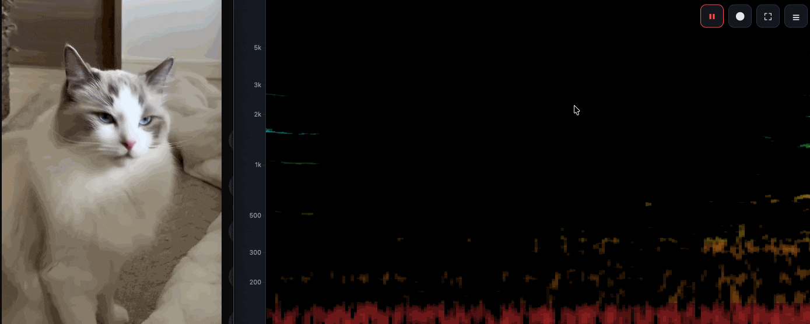

# Spectri

A lightweight, standalone browser spectrogram visualizer for live microphone audio. Static app that runs entirely in the browser. No server, no build step, no dependencies.

**Access here:** [https://rzagreb.github.io/spectri/app](https://rzagreb.github.io/spectri/app)

  

## Features

- Live microphone input with a device picker
- Four visualization modes:
  - **Spectrogram** — classic scrolling time × frequency view
  - **Galaxy** — the live spectrum wrapped into a glowing spiral (bass at the core, highs at the rim)
  - **EQ Bands** — ten standard octave bands as a scrolling bar history
  - **Rainbow** — the scrolling spectrogram with each frequency zone tinted its own color
- Record & replay: capture a session, then drag a box on the static spectrogram to isolate a time × frequency region and hear just that band (highpass + lowpass filtering), with a sweeping playback cursor and optional looping
- Select all + export the selection (or whole take) to a WAV file
- Immersive view: hide all UI for an always-on display (Esc to exit)
- Linear or logarithmic frequency axis with labeled ticks

### Controls

- Start, Pause/Resume, and Clear
- Mode and FFT size (512, 1024, 2048, 4096, 8192)
- Color schemes: Viridis, Magma, Inferno, Jet, Grayscale (Rainbow mode uses its
  own per-zone palette)
- Log scale toggle
- Min/Max frequency range (Hz)
- dB floor & ceiling
- Smoothing
- Contrast (dynamic range)
- Scroll speed

### URL parameters

Settings can be preset from the URL so you can bookmark or share a configured view, e.g. `app/?mode=galaxy&floor=-100&fmin=100&fmax=8000&log=1`. Invalid or unknown parameters are ignored and fall back to the defaults.

| Param    | Meaning                | Values |
|----------|------------------------|--------|
| `mode`   | Visualization mode     | `classic`, `galaxy`, `bands`, `rainbow` |
| `fft`    | FFT size               | `512`, `1024`, `2048`, `4096`, `8192` |
| `color`  | Color scheme           | `viridis`, `magma`, `inferno`, `jet`, `grayscale` |
| `log`    | Log frequency axis     | `1`/`0` or `true`/`false` |
| `fmin`   | Min frequency (Hz)     | ≥ 0 |
| `fmax`   | Max frequency (Hz)     | ≥ 10 |
| `floor`  | dB floor               | −120 to −20 |
| `ceil`   | dB ceiling             | −60 to 0 |
| `smooth` | Smoothing              | 0 to 0.95 |
| `gamma`  | Contrast               | 0.6 to 4 |
| `speed`  | Scroll speed           | 1 to 8 |

### Examples

A spectrogram could have many applications

| Use                                                    | What to look for                                             | Open                                                         |
| ------------------------------------------------------ | ------------------------------------------------------------ | ------------------------------------------------------------ |
| **Find a machine fault** (failing fan, bearing, motor) | A new steady whine line or a comb of evenly-spaced harmonics that wasn't there before; clicks and knocks show as vertical streaks. | [Open](https://rzagreb.github.io/spectri/app/?mode=classic&log=0&fmin=20&fmax=10000&color=magma&smooth=0&gamma=1&floor=-100) |
| **Identify birds & wildlife** (dawn chorus)            | The chirp's shape — sweeps, trills, and stacked harmonics are a species fingerprint. | [Open](https://rzagreb.github.io/spectri/app/?mode=classic&log=1&fmin=300&fmax=12000&color=viridis&smooth=0&speed=3) |
| **Spot speech & voices** (is someone talking?)         | Slowly-moving stacks of harmonic lines (voiced vowels) plus brief broadband puffs (consonants) — a signature that stands out from steady noise. | [Open](https://rzagreb.github.io/spectri/app/?mode=classic&log=1&fmin=80&fmax=8000&color=inferno&smooth=0.1&gamma=1) |
